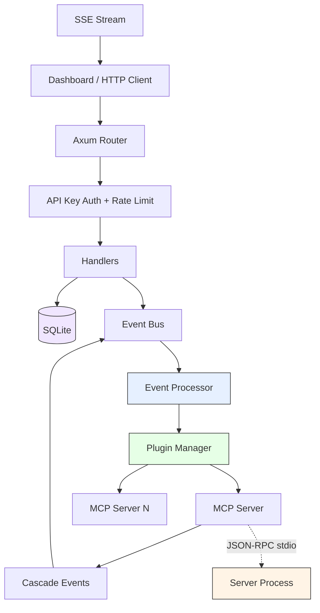

<div align="center">

# ClotoCore

### Build Your Own AI Partner

An open-source AI container platform written in Rust.
Sandboxed plugins, GUI dashboard, and your AI stays on your machine.

[]()
[](LICENSE)

[Documentation](docs/ARCHITECTURE.md) · [Vision](docs/PROJECT_VISION.md)

</div>

---

## What is ClotoCore?

ClotoCore is a platform for building advanced AI agents — not chatbots, not assistants, but **AI partners** with personality, capabilities, and memory.

Inspired by projects like [Neuro-Sama](https://www.twitch.tv/vedal987), ClotoCore lets anyone construct sophisticated AI systems through a plugin architecture and GUI dashboard, without writing a single line of code.

**AI Container** = Plugin Set + Personality Definition + Capability Set

```
Example: "VTuber AI" Container          Example: "Research Assistant" Container
├── reasoning: DeepSeek                  ├── reasoning: Claude / GPT-4o
├── vision: Screen capture plugin        ├── tools: File search, Web search
├── personality: Character definition    ├── personality: Academic, precise
├── voice: TTS/STT plugin               └── memory: Long-term memory plugin
└── avatar: Live2D/VRM plugin
```

## Why ClotoCore?

|  | ClotoCore | Chat-based AI frameworks |
|--|------|--------------------------|
| **Language** | Rust — memory safe, fast, low resource | TypeScript / Python |
| **Security** | Sandboxed plugins, permission isolation, host whitelisting, DNS rebinding protection | Broad local permissions |
| **Interface** | GUI dashboard + Tauri desktop app | Chat / CLI only |
| **Design** | Plugin-composed AI containers | Monolithic agents |
| **Extension** | MCP server plugins (any language) | Single language |

## Architecture



**Key design principles:**

- **Core Minimalism** — The kernel is a stage, not an actor. All intelligence lives in plugins.
- **Event-First** — Plugins communicate through an async event bus, never directly.
- **Capability Injection** — Plugins cannot instantiate network clients. The kernel injects pre-authorized, sandboxed capabilities.
- **Human-in-the-Loop** — Sensitive operations require explicit admin approval at runtime.

## Quick Start

```bash
git clone https://github.com/Cloto-dev/ClotoCore.git
cd ClotoCore
cargo build --release
cargo run --package cloto_core
```

The dashboard opens at **http://localhost:8081**.

## MCP Servers

All plugin functionality is delivered via **MCP (Model Context Protocol)** servers:

| Server | Type | Description |
|--------|------|-------------|
| `mind.deepseek` | Reasoning | Advanced reasoning via DeepSeek API |
| `mind.cerebras` | Reasoning | Ultra-high-speed reasoning via Cerebras API |
| `memory.ks22` | Memory | Persistent memory with FTS5 search + vector embedding |
| `tool.terminal` | Tool | Sandboxed shell command execution |
| `tool.embedding` | Tool | Vector embedding generation (OpenAI API / local ONNX) |

MCP servers are configured via `mcp.toml` and can be written in any language.
See [MCP Plugin Architecture](docs/MCP_PLUGIN_ARCHITECTURE.md) for details.

## Project Structure

```
crates/core/        Kernel — event bus, MCP manager, HTTP API, rate limiter
crates/shared/      SDK — traits and shared types
crates/cli/         CLI client with interactive TUI
mcp-servers/        MCP servers (Python): deepseek, cerebras, ks22, terminal, embedding
dashboard/          React/TypeScript web UI (Tauri desktop app)
scripts/            Build tools, verification scripts
docs/               Architecture, vision, changelog
```

## Configuration

Copy `.env.example` to `.env` to customize. All settings have sensible defaults.

| Variable | Default | Description |
|----------|---------|-------------|
| `PORT` | `8081` | HTTP server port |
| `CLOTO_API_KEY` | (none) | Admin API key (required in release builds) |
| `DEEPSEEK_API_KEY` | (none) | DeepSeek API key |
| `CEREBRAS_API_KEY` | (none) | Cerebras API key |
| `BIND_ADDRESS` | `127.0.0.1` | Server bind address |
| `ALLOWED_HOSTS` | (none) | Network whitelist for plugin HTTP access |
| `MAX_EVENT_DEPTH` | `10` | Maximum event cascading depth |
| `RUST_LOG` | `info` | Log level filter |

<details>
<summary>All configuration variables</summary>

| Variable | Default | Description |
|----------|---------|-------------|
| `PORT` | `8081` | HTTP server port |
| `DATABASE_URL` | `sqlite:{exe_dir}/data/cloto_memories.db` | SQLite database path |
| `CLOTO_API_KEY` | (none) | Admin API key (required in release builds) |
| `DEEPSEEK_API_KEY` | (none) | DeepSeek API key |
| `CEREBRAS_API_KEY` | (none) | Cerebras API key |
| `CONSENSUS_ENGINES` | `mind.deepseek,mind.cerebras` | Engine IDs for consensus mode |
| `DEFAULT_AGENT_ID` | `agent.cloto_default` | Default agent for `/api/chat` |
| `CLOTO_SKIP_ICON_EMBED` | (none) | Set to `1` to skip icon embedding during dev builds |
| `RUST_LOG` | `info` | Log level filter |
| `MAX_EVENT_DEPTH` | `10` | Maximum event cascading depth |
| `PLUGIN_EVENT_TIMEOUT_SECS` | `30` | Plugin event handler timeout |
| `CORS_ORIGINS` | (none) | Allowed CORS origins (comma-separated) |
| `ALLOWED_HOSTS` | (none) | Network whitelist for plugin access |
| `BIND_ADDRESS` | `127.0.0.1` | Server bind address (`0.0.0.0` for network access) |
| `MEMORY_CONTEXT_LIMIT` | `10` | Maximum memory entries returned per recall |
| `EVENT_HISTORY_SIZE` | `1000` | Maximum events kept in memory |
| `EVENT_RETENTION_HOURS` | `24` | Hours to retain events before cleanup (1-720) |
| `CLOTO_MAX_AGENTIC_ITERATIONS` | `16` | Maximum tool-use loop iterations (1-64) |
| `CLOTO_MCP_CONFIG` | (none) | Path to mcp.toml configuration file |
| `CLOTO_TOOL_TIMEOUT_SECS` | `30` | Tool execution timeout in seconds (1-300) |
| `HEARTBEAT_INTERVAL_SECS` | `30` | Agent heartbeat ping interval |

</details>

## API

<details>
<summary>Public endpoints</summary>

| Method | Path | Description |
|--------|------|-------------|
| GET | `/api/system/version` | Current version info |
| GET | `/api/events` | SSE event stream |
| GET | `/api/history` | Event history |
| GET | `/api/metrics` | System metrics |
| GET | `/api/memories` | Memory entries |
| GET | `/api/plugins` | Plugin list with manifests |
| GET | `/api/plugins/:id/config` | Plugin configuration |
| GET | `/api/agents` | Agent configurations |
| GET | `/api/permissions/pending` | Pending permission requests |
| GET | `/api/mcp/access/by-agent/:agent_id` | Agent MCP tool access |

</details>

<details>
<summary>Admin endpoints (requires X-API-Key header)</summary>

| Method | Path | Description |
|--------|------|-------------|
| POST | `/api/system/shutdown` | Graceful shutdown |
| POST | `/api/plugins/apply` | Bulk enable/disable plugins |
| POST | `/api/plugins/:id/config` | Update plugin config |
| POST | `/api/plugins/:id/permissions/grant` | Grant permission to plugin |
| POST | `/api/agents` | Create agent |
| POST | `/api/agents/:id` | Update agent |
| POST | `/api/agents/:id/power` | Toggle agent power state |
| POST | `/api/events/publish` | Publish event to bus |
| POST | `/api/permissions/:id/approve` | Approve a request |
| POST | `/api/permissions/:id/deny` | Deny a request |
| POST | `/api/chat` | Send message to agent |
| GET/POST/DELETE | `/api/chat/:agent_id/messages` | Chat message persistence |
| GET | `/api/chat/attachments/:attachment_id` | Retrieve chat attachment |
| GET/POST | `/api/mcp/servers` | List/create MCP servers |
| DELETE | `/api/mcp/servers/:name` | Delete MCP server |
| GET/PUT | `/api/mcp/servers/:name/settings` | Server settings |
| GET/PUT | `/api/mcp/servers/:name/access` | Access control |
| POST | `/api/mcp/servers/:name/start\|stop\|restart` | Server lifecycle |

</details>

## Testing

90 tests.

```bash
cargo test                              # all tests
cargo test --package cloto_core          # kernel only
cargo test --test '*'                   # integration tests only
```

## Security

- **API key authentication** with per-IP rate limiting (10 req/s, burst 20)
- **Append-only audit log** in SQLite for all permission decisions
- **Minimal default permissions** — elevated permissions require human approval
- **Network host whitelisting** with DNS rebinding protection
- **MCP access control** with 3-level RBAC (capability → server → tool)

See [Architecture](docs/ARCHITECTURE.md) for the full security model.

## Documentation

- [Architecture](docs/ARCHITECTURE.md) — Design principles, event flow, security model
- [Project Vision](docs/PROJECT_VISION.md) — Strategic direction and roadmap
- [Development](docs/DEVELOPMENT.md) — Coding standards, guardrails, PR process
- [Changelog](docs/CHANGELOG.md) — Development history
- [MCP Architecture](docs/MCP_PLUGIN_ARCHITECTURE.md) — MCP server communication protocol

## License

**Business Source License 1.1** — converts to **MIT** on 2028-02-14.

You can freely use ClotoCore for plugin development, internal tools, consulting, education, and small-scale commercial projects. Large-scale commercial deployment (>$100k revenue, >1,000 users, >50 employees, or SaaS) requires prior approval. See [LICENSE](LICENSE) for the full terms.

## Community

- [GitHub Issues](https://github.com/Cloto-dev/ClotoCore/issues)
- [GitHub Discussions](https://github.com/Cloto-dev/ClotoCore/discussions)
- [X (Twitter)](https://x.com/cloto_dev)

## Note

Built by a solo developer from Japan. Most of the code and documentation in this project was written with the assistance of AI. If you find any issues, please open an [issue](https://github.com/Cloto-dev/ClotoCore/issues).
