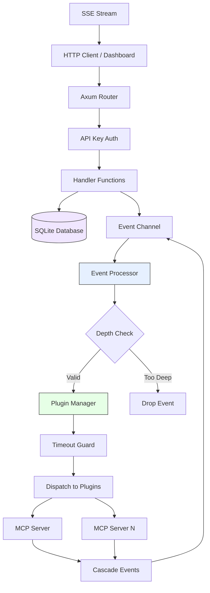

# ClotoCore Architecture

ClotoCoreは、高度な柔軟性、安全性、および拡張性を備えたAIエージェント・プラットフォームです。本ドキュメントは設計原則、セキュリティフレームワーク、プラグイン通信機構、およびサブプロジェクトの仕様を統合的に定義します。

---

## 0. System Overview

### 0.1 High-Level Architecture



### 0.2 Request Flow

```
Client Request
  │
  ├─ GET /api/agents ──────────────────► get_agents() ──► DB Query ──► JSON Response
  ├─ POST /api/chat ────► check_auth() ──► chat_handler() ──► Event Bus ──► Plugin Processing
  ├─ GET /api/events/stream ───────────► sse_handler() ──► Broadcast Subscribe ──► SSE Stream
  └─ POST /api/plugins/:id/permissions ► check_auth() ──► grant_permission() ──► Event + Audit Log
```

### 0.3 Event Processing Pipeline

```
1. Event Injected (HTTP handler / plugin cascade / system)
       │
2. EnvelopedEvent wraps event with source_plugin_id + trace_id
       │
3. Event Channel (mpsc) buffers event
       │
4. Event Processor loop:
   ├── Depth check (max 5 levels, prevents infinite cascade)
   ├── Broadcast to SSE subscribers
   ├── Save to event history ring buffer
   └── Dispatch to Plugin Manager
           │
5. Plugin Manager:
   ├── Filter active plugins
   ├── Apply timeout guard (per-plugin)
   └── Call plugin.on_event() concurrently
           │
6. Plugin responses may generate cascade events → back to step 1
```

### 0.4 Crate Structure

```
ClotoCore/
├── crates/
│   ├── core/          # Kernel: HTTP server, handlers, event loop, database
│   │   └── src/
│   │       ├── handlers.rs      # HTTP API handlers (agents, plugins, events, auth)
│   │       ├── handlers/        # Sub-handlers (system, assets, chat, mcp, skill_manager)
│   │       ├── config.rs        # AppConfig from environment variables
│   │       ├── db.rs            # SQLite schema, queries, audit logging
│   │       ├── managers.rs      # PluginManager, AgentManager, PluginRegistry
│   │       ├── middleware.rs    # Rate limiter, request tracking
│   │       └── lib.rs           # AppState, router setup, event processor
│   └── shared/        # Plugin SDK: traits, types, macros
│       └── src/lib.rs           # Plugin, ReasoningEngine, Tool traits
│
├── mcp-servers/        # MCP servers (Python, any language)
├── dashboard/          # React/TypeScript web UI (Tauri desktop app)
├── archive/            # Archived features (evolution, update, docs)
├── scripts/            # Build tools, verification scripts
├── qa/                 # Issue registry (version-controlled bug tracking)
└── docs/               # Architecture, changelog, development guides
```

### 0.5 API Endpoint Summary

**Admin Endpoints** (requires `X-API-Key` header, rate-limited):

| Method | Route | Description |
|--------|-------|-------------|
| POST | `/api/system/shutdown` | Graceful shutdown |
| POST | `/api/plugins/apply` | Bulk enable/disable plugins |
| POST | `/api/plugins/:id/config` | Update plugin config |
| POST | `/api/plugins/:id/permissions/grant` | Grant permission to plugin |
| POST | `/api/agents` | Create agent |
| POST | `/api/agents/:id` | Update agent |
| POST | `/api/agents/:id/power` | Toggle agent power state |
| POST | `/api/events/publish` | Publish event to bus |
| POST | `/api/permissions/:id/approve` | Approve permission request |
| POST | `/api/permissions/:id/deny` | Deny permission request |
| POST | `/api/chat` | Send message to agent |
| GET/POST/DELETE | `/api/chat/:agent_id/messages` | Chat message persistence |
| GET | `/api/chat/attachments/:attachment_id` | Retrieve chat attachment |
| POST/GET | `/api/mcp/servers` | MCP server management |
| DELETE | `/api/mcp/servers/:name` | Delete MCP server |
| GET/PUT | `/api/mcp/servers/:name/settings` | Server settings |
| GET/PUT | `/api/mcp/servers/:name/access` | Access control |
| POST | `/api/mcp/servers/:name/start\|stop\|restart` | Lifecycle |

**Public Endpoints** (no authentication required):

| Method | Route | Description |
|--------|-------|-------------|
| GET | `/api/system/version` | Current version info |
| GET | `/api/events` | SSE event stream |
| GET | `/api/history` | Recent event history |
| GET | `/api/metrics` | System metrics |
| GET | `/api/memories` | Memory entries |
| GET | `/api/plugins` | Plugin list with manifests |
| GET | `/api/plugins/:id/config` | Plugin configuration |
| GET | `/api/agents` | Agent configurations |
| GET | `/api/permissions/pending` | Pending permission requests |
| GET | `/api/mcp/access/by-agent/:agent_id` | Agent MCP access |
| ANY | `/api/plugin/*path` | Dynamic plugin route proxy |

---

## 1. Design Principles (Manifesto)

本システムにおける全ての開発は、以下の9つの設計原則に従わなければなりません。

### 1.1 Core Minimalism (核の最小化)
**「Kernelは舞台であり、役者ではない」**
- **Kernelの責務**: プラグインのライフサイクル管理、イベントの仲介、データの永続化インターフェースの提供、Webサーバーの土台提供。
- **禁止事項**: 特定のAIモデル（LLM）への依存ロジック、特定のメモリ形式の処理ロジックなど、機能そのものをKernel内にハードコードすること。
- **目標**: Kernelを修正することなく、あらゆる機能をプラグインの追加・差し替えだけで実現する。

### 1.2 Capability over Concrete Type (具象ではなく能力を)
**「誰であるかではなく、何ができるか」**
- **設計指針**: プラグインのIDや名前を直接参照して処理を分岐させない。代わりに `CapabilityType` (Reasoning, Memory, HAL等) を通じてプラグインを呼び出す。
- **メリット**: 深い階層でのプラグイン差し替えが可能になり、システム全体のポータビリティが向上する。

### 1.3 Event-First Communication (イベントバス至上主義)
**「直接話さず、広場に投げろ」**
- **設計指針**: プラグイン間、あるいはKernelとプラグイン間の連携は、可能な限りイベントバス（`ClotoEvent`）を介して非同期・疎結合に行う。
- **目標**: AプラグインがBプラグインの存在を知らなくても、特定のイベントに反応するだけで機能が統合される状態を作る。

### 1.4 Data Sovereignty (データの主権はプラグインに)
**「Kernelはデータを預かるが、中身は解釈しない」**
- **設計指針**: プラグイン固有の設定やエージェントの属性は、Kernelのテーブルを拡張せず、不透明な `metadata` (JSON) として扱う。
- **目標**: データベーススキーマを変更せずに、プラグインが自由に独自の内部データ構造を定義・永続化できるようにする。

### 1.5 Strict Permission Isolation (厳格な権限分離)
**「能力には責任と権限が伴う」**
- **設計指針**: 機能（Capability）の提供と、リソースへのアクセス（Permission）を分離する。
- **目標**: 「ファイルに書き込めるが、ネットワークには出られないエージェント」といった、セキュアな実行環境をメタデータ定義だけで実現する。

### 1.6 Seamless Integration & DevEx (シームレスな統合と開発体験)
**「原則はガードレールであり、壁ではない」**
- **設計指針**: 厳格な原則が開発の足かせにならないよう、SDK（Macros, Utilities）を通じてアーキテクチャの複雑さを隠蔽する。
- **アプローチ**:
    - **Macro-driven Compliance**: 定型的なトレイト実装やマニフェスト定義をマクロ化し、人為的ミスと記述量を最小化する。
    - **Encapsulated Complexity**: イベントのフィルタリングやストレージの初期化など、共通パターンをSDKレベルで抽象化する。

### 1.7 Polyglot Extension (多言語拡張の正解)
**「核は Rust で守り、翼は Python で広げる」**
- **設計指針**: 高度な数値計算や広大なライブラリ資産が必要な場合、Core に機能を追加せず、「AIコンテナ (Bridge Plugin)」を通じて他言語環境（主に Python）を統合する。

### 1.8 Dynamic Intelligence Orchestration (知能の動的編成)
**「能力は与えられるものではなく、勝ち取るもの」**
- **設計指針**: AIエージェントの権限は起動時に固定せず、実行中に「意図」に基づいて動的に要求・付与（Human-in-the-loop）されるべきである。
- **目標**: 最小権限原則を維持しつつ、必要に応じて人間が AI の能力を即座に解放できる動的なエコシステムを実現する。

### 1.9 Self-Healing AI Containerization (自己修復型コンテナ化)
**「死んでも蘇り、止まらずに進め」**
- **設計指針**: 外部ランタイム（AIコンテナ）は Kernel から物理的に隔離されるだけでなく、異常発生時に自律的にリセット・復旧する能力を持たなければならない。

---

## 2. Security and Governance Framework

### 2.1 三層のセキュリティ構造

1. **物理的隔離 (Containerization)**: 各エージェント（特に対外接続を行うもの）は、Kernel とは独立した OS プロセスとして実行される。
2. **認可ゲート (Authorization Gate)**: すべての行動意図（`ActionRequested`, `PermissionRequested`）は、Kernel のイベントプロセッサを通過し、ホワイトリストに基づいたフィルタリングが行われる。
3. **能力注入 (Capability Injection)**: プラグインは自身で通信ライブラリをインスタンス化できない。Kernel から渡された「認可済みの道具」のみを通じて外部と接触する。
4. **イベント封印 (Event Enveloping)**: すべてのプラグインイベントは `EnvelopedEvent` に包まれ、送信元 ID の偽装を物理的に防ぐ。

### 2.2 動的権限昇格 (Human-in-the-loop)

1. AI コンテナが現在の権限では実行不可能な操作を検知
2. `ClotoEvent::PermissionRequested` を発行
3. Dashboard の Security Guard UI がユーザーに承認を要求
4. ユーザーが承認
5. Kernel が DB を更新し、実行中のコンテナへライブで能力を注入

### 2.3 SafeHttpClient

- **Host 制限**: `localhost` やプライベート IP へのアクセスをデフォルトで遮断
- **ドメイン制御**: ホワイトリストによるドメイン制限 (HashSet による O(1) 検索)
- **DNS Rebinding 対策**: 名前解決後の IP アドレスも制限チェック

### 2.4 運用指針

- **最小権限**: マニフェストの `required_permissions` には真に必要な最小限の項目のみを記述
- **明示的な理由**: 権限要求時は `reason` フィールドに人間が理解できる説明を記述

---

## 3. Plugin Interaction Mechanisms

### 3.1 MCP Server Architecture

All plugin functionality is delivered via **Model Context Protocol (MCP)** servers.
MCP servers are independent processes that communicate with the Kernel via JSON-RPC over stdio.

For full architecture details, see [MCP Plugin Architecture](MCP_PLUGIN_ARCHITECTURE.md).

**Key characteristics:**
- Servers defined in `mcp-servers/` and configured via `mcp.toml`
- Language-agnostic: any language implementing MCP protocol
- Process isolation: each server runs as a separate OS process
- Dual dispatch: PluginRegistry checks Rust plugins first, then MCP servers (future-proof)
- Access control: 3-level RBAC (capability → server_grant → tool_grant)

### 3.2 Plugin Architecture History

> **Note:** The original Three-Tier Plugin Model (Rust compiled → Python Bridge → WASM)
> has been superseded by the MCP-only architecture. See [MCP Plugin Architecture](MCP_PLUGIN_ARCHITECTURE.md).
> The WASM design document is archived at `archive/docs/WASM_PLUGIN_DESIGN.md`.

---

## 4. Project Oculi: Eye-Tracking & Visual Symbiosis (Paused)

> **Status:** Paused. Python Bridge (sensor layer) has been removed. Vision/cursor plugins archived.
> Future implementation would use MCP server-based approach.

人間の視線（Gaze）を AI とリアルタイムに共有し、Foveated Vision による低レイテンシ・低コスト推論を実現するサブプロジェクト。

**Original Roadmap:**
- [x] Phase 1: Communication Infrastructure (GazeUpdated イベント, ストリーミング対応)
- [x] Phase 2: Neural Synchronization (MediaPipe 視線推定, ダッシュボード同期)
- [ ] Phase 3: Foveated Vision — paused
- [ ] Phase 4: Intent Discovery — paused

---

## 5. Self-Evolution Engine (Archived)

> **Status:** Archived for Phase A. Code preserved in `archive/evolution/`.
>
> The evolution engine implements 5-axis fitness scoring (cognitive, behavioral,
> safety, autonomy, meta_learning), generation management with debounce,
> rollback with grace periods, and safety breach detection.
>
> See the archived source code for full design specifications.

---

## 運用

この原則群は ClotoCore における「正解」を定義するものです。コード監査においては以下を評価基準とします:
1. **整合性**: 各コンポーネントが上記原則に則っているか
2. **持続可能性**: SDKやマクロにより原則への準拠が「容易」な状態に保たれているか
