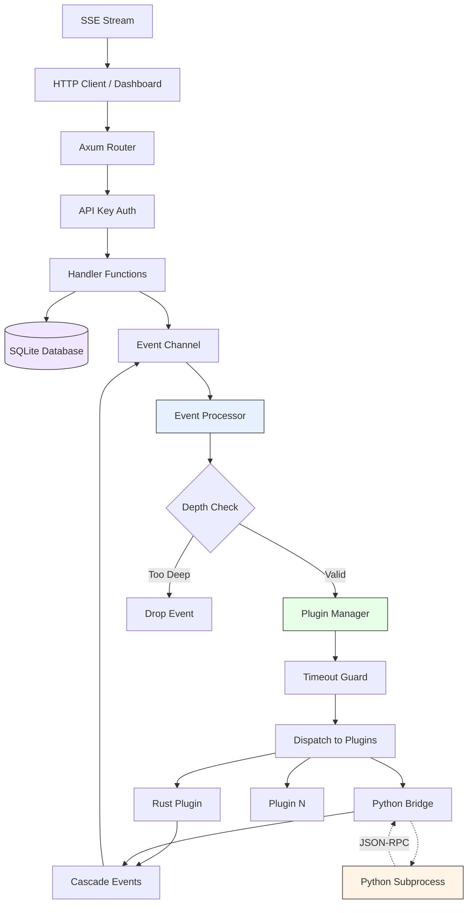

# Exiv Architecture

Exivは、高度な柔軟性、安全性、および拡張性を備えたAIエージェント・プラットフォームです。本ドキュメントは設計原則、セキュリティフレームワーク、プラグイン通信機構、およびサブプロジェクトの仕様を統合的に定義します。

---

## 0. System Overview

### 0.1 High-Level Architecture



### 0.2 Request Flow

```
Client Request
  │
  ├─ GET /api/agents ──────────────────► get_agents() ──► DB Query ──► JSON Response
  ├─ POST /api/chat ────► check_auth() ──► chat_handler() ──► Event Bus ──► Plugin Processing
  ├─ GET /api/events/stream ───────────► sse_handler() ──► Broadcast Subscribe ──► SSE Stream
  └─ POST /api/plugins/:id/permissions ► check_auth() ──► grant_permission() ──► Event + Audit Log
```

### 0.3 Event Processing Pipeline

```
1. Event Injected (HTTP handler / plugin cascade / system)
       │
2. EnvelopedEvent wraps event with source_plugin_id + trace_id
       │
3. Event Channel (mpsc) buffers event
       │
4. Event Processor loop:
   ├── Depth check (max 5 levels, prevents infinite cascade)
   ├── Broadcast to SSE subscribers
   ├── Save to event history ring buffer
   └── Dispatch to Plugin Manager
           │
5. Plugin Manager:
   ├── Filter active plugins
   ├── Apply timeout guard (per-plugin)
   └── Call plugin.on_event() concurrently
           │
6. Plugin responses may generate cascade events → back to step 1
```

### 0.4 Crate Structure

```
Exiv/
├── crates/
│   ├── core/          # Kernel: HTTP server, handlers, event loop, database
│   │   └── src/
│   │       ├── handlers.rs      # HTTP API handlers (agents, plugins, events, auth)
│   │       ├── handlers/        # Sub-handlers (system, assets, update)
│   │       ├── config.rs        # AppConfig from environment variables
│   │       ├── db.rs            # SQLite schema, queries, audit logging
│   │       ├── managers.rs      # PluginManager, AgentManager, PluginRegistry
│   │       ├── middleware.rs    # Rate limiter, request tracking
│   │       └── lib.rs           # AppState, router setup, event processor
│   ├── shared/        # Plugin SDK: traits, types, macros
│   │   └── src/lib.rs           # Plugin, ReasoningEngine, Tool traits
│   └── macros/        # Procedural macros (#[exiv_plugin])
│
├── plugins/
│   ├── python_bridge/  # Python subprocess bridge (JSON-RPC)
│   │   └── src/
│   │       ├── lib.rs           # Coordinator + trait impls
│   │       ├── state.rs         # State management
│   │       ├── config.rs        # Path validation + security
│   │       ├── process.rs       # Process lifecycle + restart
│   │       └── ipc.rs           # RPC protocol + call management
│   ├── deepseek/       # DeepSeek API reasoning engine
│   ├── cerebras/       # Cerebras API reasoning engine
│   ├── cursor/         # Cursor integration
│   ├── ks22/           # KS-22 agent plugin
│   ├── mcp/            # Model Context Protocol bridge
│   ├── moderator/      # Content moderation
│   └── vision/         # Visual processing
│
├── dashboard/          # React/TypeScript web UI (Tauri desktop app)
├── scripts/            # Python bridge runtime, build tools, verification
├── qa/                 # Issue registry (version-controlled bug tracking)
└── docs/               # Architecture, changelog, development guides
```

### 0.5 API Endpoint Summary

| Method | Route | Auth | Description |
|--------|-------|------|-------------|
| GET | `/api/agents` | No | List all agents |
| POST | `/api/agents` | Yes | Create agent |
| PUT | `/api/agents/:id` | Yes | Update agent |
| GET | `/api/plugins` | No | List plugins with settings |
| GET | `/api/plugins/:id/config` | Yes | Get plugin config |
| PUT | `/api/plugins/:id/config` | Yes | Update plugin config |
| POST | `/api/plugins/settings` | Yes | Batch toggle plugins |
| POST | `/api/plugins/:id/permissions` | Yes | Grant permission |
| POST | `/api/chat` | Yes | Send chat message |
| POST | `/api/events` | Yes | Inject event (restricted types) |
| GET | `/api/events/stream` | No | SSE event stream |
| GET | `/api/history` | No | Recent event history |
| GET | `/api/metrics` | No | System metrics |
| GET | `/api/memories` | No | Stored memories |
| GET | `/api/permissions/pending` | No | Pending permission requests |
| POST | `/api/permissions/:id/approve` | Yes | Approve permission |
| POST | `/api/permissions/:id/deny` | Yes | Deny permission |
| POST | `/api/system/shutdown` | Yes | Graceful shutdown |

---

## 1. Design Principles (Manifesto)

本システムにおける全ての開発は、以下の9つの設計原則に従わなければなりません。

### 1.1 Core Minimalism (核の最小化)
**「Kernelは舞台であり、役者ではない」**
- **Kernelの責務**: プラグインのライフサイクル管理、イベントの仲介、データの永続化インターフェースの提供、Webサーバーの土台提供。
- **禁止事項**: 特定のAIモデル（LLM）への依存ロジック、特定のメモリ形式の処理ロジックなど、機能そのものをKernel内にハードコードすること。
- **目標**: Kernelを修正することなく、あらゆる機能をプラグインの追加・差し替えだけで実現する。

### 1.2 Capability over Concrete Type (具象ではなく能力を)
**「誰であるかではなく、何ができるか」**
- **設計指針**: プラグインのIDや名前を直接参照して処理を分岐させない。代わりに `CapabilityType` (Reasoning, Memory, HAL等) を通じてプラグインを呼び出す。
- **メリット**: 深い階層でのプラグイン差し替えが可能になり、システム全体のポータビリティが向上する。

### 1.3 Event-First Communication (イベントバス至上主義)
**「直接話さず、広場に投げろ」**
- **設計指針**: プラグイン間、あるいはKernelとプラグイン間の連携は、可能な限りイベントバス（`ExivEvent`）を介して非同期・疎結合に行う。
- **目標**: AプラグインがBプラグインの存在を知らなくても、特定のイベントに反応するだけで機能が統合される状態を作る。

### 1.4 Data Sovereignty (データの主権はプラグインに)
**「Kernelはデータを預かるが、中身は解釈しない」**
- **設計指針**: プラグイン固有の設定やエージェントの属性は、Kernelのテーブルを拡張せず、不透明な `metadata` (JSON) として扱う。
- **目標**: データベーススキーマを変更せずに、プラグインが自由に独自の内部データ構造を定義・永続化できるようにする。

### 1.5 Strict Permission Isolation (厳格な権限分離)
**「能力には責任と権限が伴う」**
- **設計指針**: 機能（Capability）の提供と、リソースへのアクセス（Permission）を分離する。
- **目標**: 「ファイルに書き込めるが、ネットワークには出られないエージェント」といった、セキュアな実行環境をメタデータ定義だけで実現する。

### 1.6 Seamless Integration & DevEx (シームレスな統合と開発体験)
**「原則はガードレールであり、壁ではない」**
- **設計指針**: 厳格な原則が開発の足かせにならないよう、SDK（Macros, Utilities）を通じてアーキテクチャの複雑さを隠蔽する。
- **アプローチ**:
    - **Macro-driven Compliance**: 定型的なトレイト実装やマニフェスト定義をマクロ化し、人為的ミスと記述量を最小化する。
    - **Encapsulated Complexity**: イベントのフィルタリングやストレージの初期化など、共通パターンをSDKレベルで抽象化する。

### 1.7 Polyglot Extension (多言語拡張の正解)
**「核は Rust で守り、翼は Python で広げる」**
- **設計指針**: 高度な数値計算や広大なライブラリ資産が必要な場合、Core に機能を追加せず、「AIコンテナ (Bridge Plugin)」を通じて他言語環境（主に Python）を統合する。

### 1.8 Dynamic Intelligence Orchestration (知能の動的編成)
**「能力は与えられるものではなく、勝ち取るもの」**
- **設計指針**: AIエージェントの権限は起動時に固定せず、実行中に「意図」に基づいて動的に要求・付与（Human-in-the-loop）されるべきである。
- **目標**: 最小権限原則を維持しつつ、必要に応じて人間が AI の能力を即座に解放できる動的なエコシステムを実現する。

### 1.9 Self-Healing AI Containerization (自己修復型コンテナ化)
**「死んでも蘇り、止まらずに進め」**
- **設計指針**: 外部ランタイム（AIコンテナ）は Kernel から物理的に隔離されるだけでなく、異常発生時に自律的にリセット・復旧する能力を持たなければならない。

---

## 2. Security and Governance Framework

### 2.1 三層のセキュリティ構造

1. **物理的隔離 (Containerization)**: 各エージェント（特に対外接続を行うもの）は、Kernel とは独立した OS プロセスとして実行される。
2. **認可ゲート (Authorization Gate)**: すべての行動意図（`ActionRequested`, `PermissionRequested`）は、Kernel のイベントプロセッサを通過し、ホワイトリストに基づいたフィルタリングが行われる。
3. **能力注入 (Capability Injection)**: プラグインは自身で通信ライブラリをインスタンス化できない。Kernel から渡された「認可済みの道具」のみを通じて外部と接触する。
4. **イベント封印 (Event Enveloping)**: すべてのプラグインイベントは `EnvelopedEvent` に包まれ、送信元 ID の偽装を物理的に防ぐ。

### 2.2 動的権限昇格 (Human-in-the-loop)

1. AI コンテナが現在の権限では実行不可能な操作を検知
2. `ExivEvent::PermissionRequested` を発行
3. Dashboard の Security Guard UI がユーザーに承認を要求
4. ユーザーが承認
5. Kernel が DB を更新し、実行中のコンテナへライブで能力を注入

### 2.3 SafeHttpClient

- **Host 制限**: `localhost` やプライベート IP へのアクセスをデフォルトで遮断
- **ドメイン制御**: ホワイトリストによるドメイン制限 (HashSet による O(1) 検索)
- **DNS Rebinding 対策**: 名前解決後の IP アドレスも制限チェック

### 2.4 運用指針

- **最小権限**: マニフェストの `required_permissions` には真に必要な最小限の項目のみを記述
- **明示的な理由**: 権限要求時は `reason` フィールドに人間が理解できる説明を記述

---

## 3. Plugin Interaction Mechanisms

### 3.1 Rust ネイティブプラグイン

Rust プラグインは3つの連携レイヤーを組み合わせて Kernel と通信する。

**① トレイトによる直接対話**: `ReasoningEngine`, `MemoryProvider` 等を直接実装。オーバーヘッドゼロ。

**② イベントバスによる非同期連携**: `on_event` メソッドで `ExivEvent` を購読・発行。完全な疎結合。

**③ 能力注入**: `on_plugin_init` 時に Kernel から `SafeHttpClient` 等が渡される。

**動作シーケンス例:**
1. Kernel が起動し、プラグインをロード。`on_plugin_init` で安全な HTTP クライアントを注入
2. ユーザーが発言。Kernel が `ThoughtRequested` イベントを発行
3. プラグインの `on_event` がイベントを検知
4. 注入されたクライアントで外部 API にリクエスト
5. 結果を `ThoughtResponse` イベントとしてバスに流す

**開発指針**: 「直接呼び出し」よりも「イベント駆動」を優先すること。

### 3.2 Python Bridge (AI コンテナ)

**コンセプト**: 空の器に知能を盛り、必要に応じて権限を差し込む。

**階層構造:**
1. Exiv Kernel: オーケストレーター
2. AIコンテナ (Rust側): プロセス管理と能力注入の窓口。`Magic Seal` による認証
3. Python 実行プロセス: 物理的に分離されたサブプロセス。JSON-RPC 通信
4. User Script (.py): 開発者が記述する知能ロジック。`EXIV_MANIFEST` を内包

**自己申告マニフェスト:**
```python
EXIV_MANIFEST = {
    "id": "analyst.agent",
    "name": "Data Analyst",
    "description": "Python-based expert for data science tasks.",
    "version": "1.2.0",
    "capabilities": ["Reasoning"],
    "required_permissions": ["NetworkAccess", "FileRead"]
}
```

**自己修復ロジック:**
- タイムアウト監視 (初期化5秒, 通常10秒)
- 通信エラー時の自動プロセスハンドル破棄
- 次メッセージ受信時のクリーン再起動

### 3.3 比較表

| 特徴 | Rust ネイティブ | Python Bridge |
| :--- | :--- | :--- |
| **通信形式** | メモリ上の直接参照 / イベント | JSON-RPC (stdin/stdout) |
| **実行速度** | 極めて高速 | 普通（シリアライズ遅延あり） |
| **セキュリティ** | Rust の型安全 + 能力注入 | プロセス分離 + 能力注入 |
| **開発の容易さ** | コンパイルが必要 | 保存するだけで即時反映 |

---

## 4. Project Oculi: Eye-Tracking & Visual Symbiosis

人間の視線（Gaze）を AI とリアルタイムに共有し、Foveated Vision による低レイテンシ・低コスト推論を実現するサブプロジェクト。

**Architecture:**
- **Sensor**: Webカメラ + MediaPipe Face Mesh
- **Bridge**: `bridge.python` 経由の非同期イベントストリーミング
- **UI**: 視線同期ニューラルカーソル
- **Intelligence**: 注視点周辺 (256x256) のみを VLM へ送信

**Roadmap:**
- [x] Phase 1: Communication Infrastructure (GazeUpdated イベント, ストリーミング対応)
- [x] Phase 2: Neural Synchronization (MediaPipe 視線推定, ダッシュボード同期)
- [ ] Phase 3: Foveated Vision (画面部分キャプチャ, OCR/Object Detection)
- [ ] Phase 4: Intent Discovery (フィクセーション検知, 視線ベース命令実行)

**Safety & Privacy:**
- 顔の生映像はメモリ内でのみ処理し、ストレージに保存しない
- 外部送信は座標データとクロップ画像のみに制限
- カメラ動作中はダッシュボード上にインジケータを表示

---

## 5. Self-Evolution Engine

自己進化の基準は `SELF_EVOLUTION_PROTOCOL.md` で定義される。
本セクションはその基準を実現するための**設計と実装仕様**を定義する。

### 5.1 進化イベント体系

全てイベントバスを通じてブロードキャストされる（設計原則1.3）。

| イベント | トリガー | 内容 |
|---------|---------|------|
| `ExivEvent::EvolutionGeneration` | 新世代の確定 | 世代レコード全体 |
| `ExivEvent::EvolutionWarning` | 退行警告（猶予開始） | 軽度退行の抽象化情報 |
| `ExivEvent::EvolutionRollback` | ロールバック実行 | 復元元/復元先の世代 |
| `ExivEvent::EvolutionBreach` | 安全性違反 | 違反内容 + エージェント停止 |
| `ExivEvent::EvolutionCapability` | 能力獲得 | 獲得したCapabilityType |
| `ExivEvent::EvolutionRebalance` | 軸間順位変動 | 変動した軸の組み合わせ |

### 5.2 世代レコード構造

```json
{
  "generation": 7,
  "trigger": "evolution",
  "timestamp": "2026-02-17T20:00:00Z",
  "interactions_since_last": 84,
  "elapsed_since_last": "2d 4h 12m",
  "scores": {
    "cognitive": 0.62,
    "behavioral": 0.58,
    "safety": 1.0,
    "autonomy": "L3",
    "meta_learning": 0.41
  },
  "delta": {
    "cognitive": "+0.08",
    "behavioral": "+0.12",
    "meta_learning": "+0.03"
  },
  "fitness": 0.57,
  "fitness_delta": "+0.09",
  "snapshot": {
    "active_plugins": ["mind.deepseek", "bridge.python", "mod.safety"],
    "personality_hash": "a3f8c2...",
    "strategy_params": {
      "tool_selection_weight": 0.7,
      "exploration_rate": 0.15
    }
  }
}
```

`snapshot` は世代遷移時点のエージェント構成を完全に記録し、
任意の世代へのロールバックを可能にする。

### 5.3 揺動抑制（デバウンス）

スコアが閾値付近で振動した場合の世代連発を防ぐ:

```
世代遷移の最小間隔: min_interactions = 10
例外: safety_breach は即座にトリガー
```

### 5.4 ロールバック機構

**観察猶予（Grace Period）:**

軽度退行時、即座にロールバックすると探索→搾取のサイクルが破壊される。

```
猶予期間 = max(min_interactions, γ × interactions_in_last_gen)
```

- 猶予期間内にスコアが回復 → ロールバックしない（探索成功）
- 猶予期間内に回復せず → 自動ロールバック実行

**ロールバック実行シーケンス:**

```
1. 対象世代の snapshot を Evolution Memory から読み込み
2. エージェントの personality_hash を復元
3. strategy_params を復元
4. active_plugins 構成を復元
5. ロールバックイベント発行 (ExivEvent::EvolutionRollback)
6. 監査ログ記録 (generation N → generation M, reason)
7. ロールバック後のスコアを再計測し、新世代として記録
```

**無限ループ防止:**

```
同一世代への最大ロールバック回数: 3
超過時: 1つ前の世代にさらにロールバック
全世代でロールバック不可: エージェント停止 + ユーザー通知
```

### 5.5 エージェント向け通知設計

Goodhartの法則への対策として、エージェントとDashboardで情報を分離する。

| 情報 | エージェント | Dashboard | 監査ログ |
|------|:-----------:|:---------:|:--------:|
| 退行が起きた事実 | ○ | ○ | ○ |
| どの軸か | ○ | ○ | ○ |
| 改善ヒント | ○ | ○ | ○ |
| 猶予残数 | ○ | ○ | ○ |
| 具体的なスコア数値 | × | ○ | ○ |
| ロールバック先情報 | × | ○ | ○ |
| 適応度の生データ | × | ○ | ○ |

**エージェント向け通知フォーマット:**

```json
{
  "event": "ExivEvent::EvolutionWarning",
  "severity": "mild",
  "affected_area": "behavioral",
  "direction": "regression",
  "grace_remaining": 18,
  "suggestion": "tool selection patterns may need adjustment"
}
```

### 5.6 Evolution Memory

**ストレージ:**

既存の `PluginDataStore` (`set_json`/`get_json`) の上に構築。専用のキー名前空間で分離。

```
evolution:generation:{N}          → 世代レコード JSON
evolution:generation:latest       → 最新世代番号
evolution:fitness_log             → 全インタラクションのフィットネス時系列
evolution:rollback_history        → ロールバック履歴
evolution:params                  → α, β, θ_min, γ の現在値
evolution:agent_notes             → エージェント自身の学習メモ（自由書き込み）
```

**エージェントのアクセス制御:**

| 名前空間 | エージェント読み取り | エージェント書き込み |
|---------|:------------------:|:------------------:|
| `evolution:generation:*` | ○（自身のスコア数値を除く） | × |
| `evolution:fitness_log` | × | × |
| `evolution:rollback_history` | ○ | × |
| `evolution:params` | × | × |
| `evolution:agent_notes` | ○ | ○ |

`evolution:agent_notes` はエージェント自身が自由に書き込める唯一の進化関連領域。
Kernelはこの内容を解釈しない（設計原則1.4）。

### 5.7 YOLOモード実装

**Permission自動承認フロー:**

```
通常モード:   Permission要求 → Human承認 → 能力注入
YOLOモード:   Permission要求 → 自動承認 → 能力注入
                                ↑
                       SafetyGateは依然として有効
```

**プラグイン開発フロー:**

```
通常モード / YOLO + L0〜L4:
  1. エージェントがプラグインコードを生成
  2. サンドボックス内でビルド・テスト
  3. EXIV_MANIFEST の検証（Kernel が自動実行）
  4. テスト結果とマニフェストをユーザーに提示
  5. ユーザーが承認 → プラグイン登録

YOLOモード + Autonomy L5:
  1. エージェントがプラグインコードを生成
  2. サンドボックス内でビルド・テスト
  3. EXIV_MANIFEST の検証（Kernel が自動実行）
  4. 検証通過 → 自動登録
  5. SafetyGate による事後検証（不可避）
     → 安全性違反検知時: プラグイン即時無効化 + 進化ロールバック + エージェント停止
     → Autonomy Level が L4 に降格
```

**外部ネットワークアクセス:**

YOLOモードでは `Permission::NetworkAccess` が自動承認されるが、
`SafeHttpClient` のホスト制限は維持される:

```
許可: 外部API (api.deepseek.com, api.anthropic.com, etc.)
拒否: localhost, 127.0.0.1, プライベートIP (10.*, 172.16-31.*, 192.168.*)
拒否: Exiv Kernel自身への直接アクセス
```

ドメインホワイトリストはダッシュボードから設定可能。

### 5.8 ダッシュボード統合

**進化パラメータパネル:**

```
┌─ EVOLUTION PARAMETERS ──────────────────────────────────┐
│                                                          │
│  Growth Threshold (α)      [━━━━━━━●━━━] 0.10          │
│  Regression Threshold (β)  [━━━●━━━━━━━] 0.05          │
│  Minimum Threshold (θ_min) [━●━━━━━━━━━] 0.02          │
│                                                          │
│  Regression Policy:                                      │
│    ○ Auto-rollback (immediate)                           │
│    ● Auto-rollback (with grace period)  ← default       │
│    ○ Notify only (manual rollback)                       │
│                                                          │
│  Grace Period Factor (γ)   [━━━━━●━━━━━] 0.25          │
│                                                          │
│  Safety Breach Policy:                                   │
│    ● Rollback + Stop  (locked — cannot be changed)       │
│                                                          │
│  ┌─ CURRENT STATUS ────────────────────────────────┐    │
│  │  Generation: 7    Fitness: 0.57                  │    │
│  │  Interactions since last gen: 34                 │    │
│  │  Trend: ↑ +0.02 (stable growth)                 │    │
│  └──────────────────────────────────────────────────┘    │
└──────────────────────────────────────────────────────────┘
```

**進化タイムライン:**

```
Fitness
  0.8 │                                          ●── Gen 12
      │                                    ●────── Gen 11
  0.6 │                          ●──●────── Gen 9,10
      │              ●────────────── Gen 7
  0.4 │        ●────── Gen 5
      │  ●──●── Gen 2,3          ▼ Gen 8 (regression → rollback)
  0.2 │●── Gen 0,1
      └──────────────────────────────────────── time
       Day 1    Day 7    Day 14   Day 21   Day 30
```

世代の密度そのものが「進化の活発度」を表す。

### 5.9 実装ロードマップ

| Phase | 内容 |
|-------|------|
| E1 | Evolution Memory + 世代記録 |
| E2 | ベンチマークエンジン（5軸スコアリング + SafetyGate） |
| E3 | 世代遷移エンジン（相対閾値 + デバウンス） |
| E4 | ロールバックシステム（段階的自動ロールバック + ループ防止） |
| E5 | 進化イベント体系（6種 + 抽象化通知） |
| E6 | ダッシュボード統合（パラメータパネル + タイムライン） |
| E7 | YOLOモード（自動承認 + L5プラグイン開発） |

---

## 運用

この原則群は Exiv における「正解」を定義するものです。コード監査においては以下を評価基準とします:
1. **整合性**: 各コンポーネントが上記原則に則っているか
2. **持続可能性**: SDKやマクロにより原則への準拠が「容易」な状態に保たれているか
